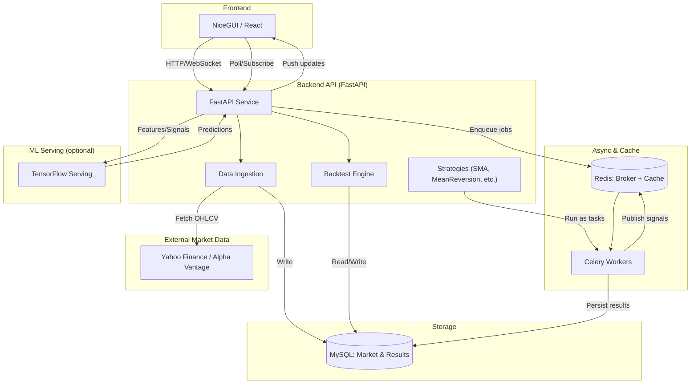

# ZQuantTrader

A real-time multi-strategy quantitative trading system with backtesting, async workers, and optional ML predictions. Designed to be modular to evolve continuously.

## Architecture



## Quickstart (Docker)

Prereqs: Docker Desktop

1. Start core services (MySQL, Redis, API, Worker, Frontend):
   ```bash
   make up
   ```

2. Open the dashboard: `http://localhost:3000`

3. Ingest data for a symbol (via UI button or API):
   ```bash
   curl -X POST "http://localhost:8000/data/ingest?symbol=AAPL&period=1mo&interval=1h"
   ```

4. Get SMA signals:
   ```bash
   curl "http://localhost:8000/signals/sma?symbol=AAPL"
   ```

5. Backtest SMA:
   ```bash
   curl -X POST "http://localhost:8000/backtest/sma?symbol=AAPL&window_short=5&window_long=20"
   ```

Optional ML serving (requires an exported TF model in `ml/model`):
```bash
docker compose --profile ml up -d tfserving
```

## Local Dev (no Docker)

Backend API (uses SQLite by default):
```bash
cd backend
python -m venv .venv && source .venv/bin/activate
pip install -r requirements.txt
uvicorn app.main:app --reload --port 8000
```

Frontend (NiceGUI):
```bash
cd frontend
python -m venv .venv && source .venv/bin/activate
pip install nicegui httpx
BACKEND_URL=http://localhost:8000 python app.py
```

## Project Layout

```
backend/
  app/
    routers/ (FastAPI endpoints)
    strategies/ (strategy modules)
    tasks/ (Celery tasks)
    config.py, db.py, models.py, main.py
  requirements.txt, Dockerfile
frontend/
  app.py (NiceGUI demo), Dockerfile
docker-compose.yml, Makefile
```

## Roadmap
- More strategies (mean reversion, breakout, pairs)
- Live streaming and WebSocket updates
- Parameterized backtests and result persistence/visualization
- ML feature engineering and model lifecycle (training + serving)
